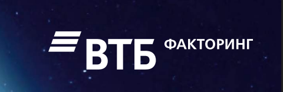
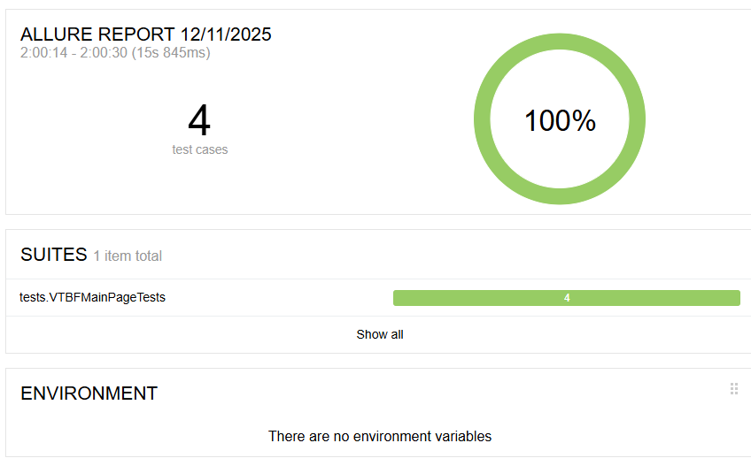

# Проект по автоматизации тестирования приложения www.vtbf.ru

## :open_book: Описание
В проекте реализованы UI тесты для главной страницы www.vtbf.ru.
Автотесты написаны на <code>Java</code> с использованием <code>JUnit 5</code> и <code>Gradle</code>.
Для UI-тестов использован фреймворк [Selenide](https://selenide.org/).

## 📋 Чек-лист проверок

### Главная страница ([https://yandex.ru/finance](https://www.vtbf.ru/))
- [ ] **TC-001**: Открыть страницу О компании
- [ ] **TC-002**: Открыть страницу Крупному бизнесу
- [ ] **TC-003**: Открыть страницу Кейсы
- [ ] **TC-004**: Открыть страницу Карьера

##  Пример Allure-отчета
### Overview

### Результат выполнения теста

Allure-отчет включает в себя:
* шаги выполнения тестов;
* скриншот страницы в браузере в момент окончания автотеста;
* Page Source;
* логи браузерной консоли;
* видео выполнения автотеста.

Пример видео из Selenoid

  

